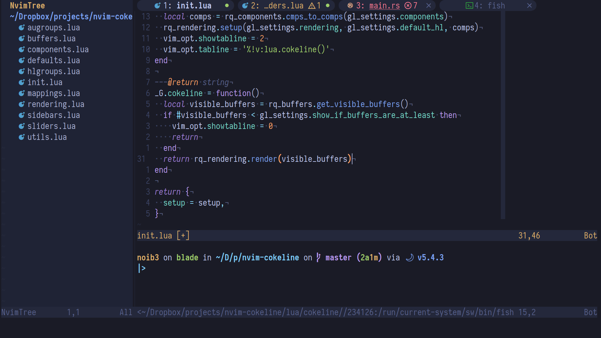
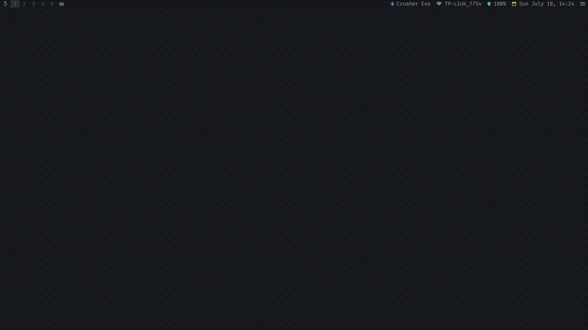
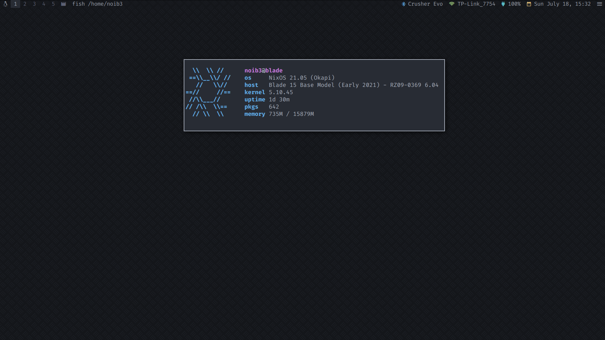
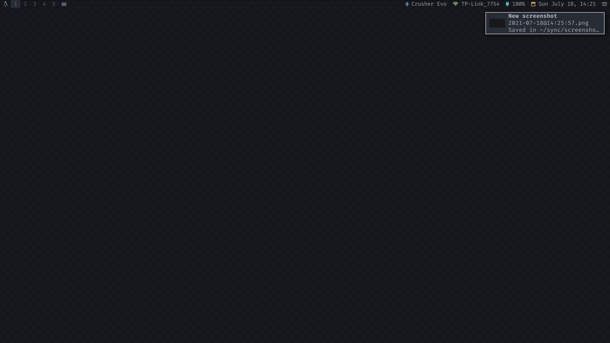

# :european_castle: dotfiles

This repository contains configuration files for the programs I use across my
machines. I use [home-manager](https://github.com/nix-community/home-manager)
to manage my user environments, which means most of the configuration files are
written in Nix.

## Gallery

| *Neovim* |
| :--: |
|  |

| *Clean* |
| :--: |
|  |

| *System infos* |
| :--: |
|  |

| *Notifications* |
| :--: |
|  |

| *qutebrowser* |
| :--: |
|  |

| *Editing this README inside neovim with markdown previews* |
| :--: |
|  |

| *Fzf inside neovim with ueberzug image previews* |
| :--: |
|  |
