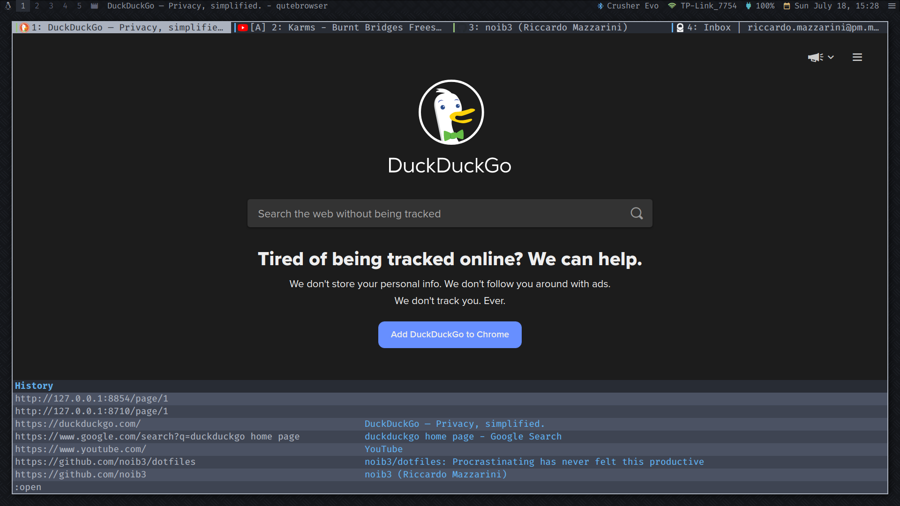
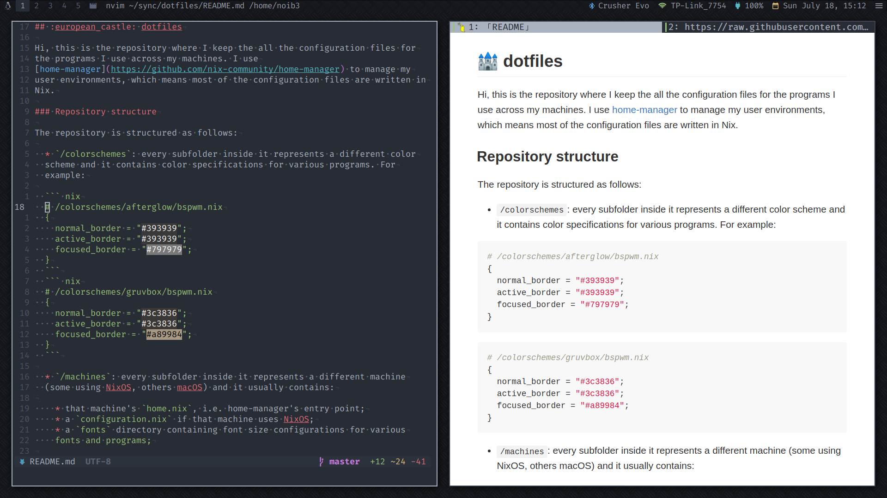
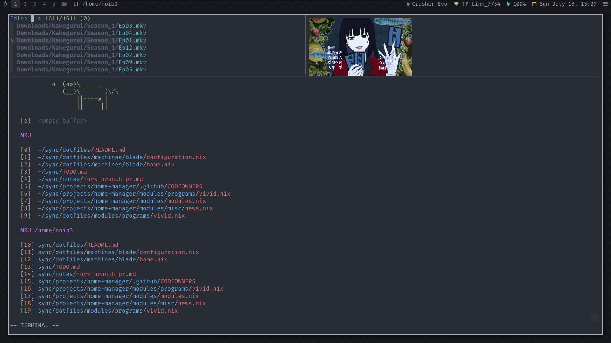

# :european_castle: dotfiles

Hi, this is the repository where I keep all the configuration files for the
programs I use across my machines. I use
[home-manager](https://github.com/nix-community/home-manager) to manage my user
environments, which means most of the configuration files are written in Nix.

## Repository structure

The repository is structured as follows:

  * `/colorschemes`: every subfolder inside it represents a different color
  scheme containing a `palette.nix` file where the main 16 colors of
  that scheme are defined. The `palette.nix` is then imported by all the other
  files in that subfolder to provide color specifications for various programs.
  The `/colorschemes` folder also contains a `hexlib.nix` file where some
  utility functions used to manipulate colors in hexadecimal format are
  defined.
  For example:

  ``` nix
  # /colorschemes/gruvbox/palette.nix
  {
    normal = {
      black = "#282828";
      red = "#cc241d";
      green = "#98971a";
      yellow = "#d79921";
      blue = "#458588";
      magenta = "#b16286";
      cyan = "#689d6a";
      white = "#ebdbb2";
    };

    bright = {
      black = "#3c3836";
      red = "#fb4934";
      green = "#b8bb26";
      yellow = "#fabd2f";
      blue = "#83a598";
      magenta = "#d3869b";
      cyan = "#8ec07c";
      white = "#a89984";
    };
  }
  ```
  &nbsp;&nbsp;&nbsp;&nbsp;&nbsp;&nbsp; and
  ``` nix
  # /colorschemes/gruvbox/bspwm.nix
  let
    colors = import ./palette.nix;
    hexlib = import ../../colorschemes/hexlib.nix;
  in
  {
    border = {
      unfocused = colors.bright.black;
      focused = hexlib.scale 130 colors.bright.white;
    };
  }
  ```

  * `/configs`: this is the heart of this repository as it contains the
  configurations for all the programs I'm using;

  * `/fonts`: every subfolder inside it represents a different font (usually
  part of the [Nerd Fonts](https://github.com/ryanoasis/nerd-fonts) family) and
  it contains font size specifications for various programs;

  * `/machines`: every subfolder inside it represents a different machine
  (some using NixOS, others macOS) and it contains:

    * that machine's `home.nix`, i.e. home-manager's entry point. This is where
    the `colorscheme` and `font` currently being used are defined. Everything
    is set up so that I can change the whole color scheme and font of my
    machines just by changing the value of those variables;
    * a `configuration.nix` if that machine uses NixOS;

  I'm currently managing two machines: a 2021 Razer Blade Stealth running NixOS
  and a 2012 MacBook Air running macOS.

## Gallery

The following screenshots were taken on the
[blade](https://github.com/noib3/dotfiles/blob/master/machines/blade) machine
using the
[onedark](https://github.com/noib3/dotfiles/blob/master/colorschemes/onedark)
color scheme together with the [Fira
Code](https://github.com/noib3/dotfiles/blob/master/fonts/fira-code)
Nerd Font.

| *Clean* |
| :--: |
|  |

| *System infos* |
| :--: |
|  |

| *Notifications* |
| :--: |
|  |

| *qutebrowser* |
| :--: |
|  |

| *Editing this README inside neovim with markdown previews* |
| :--: |
|  |

| *Fzf inside neovim with ueberzug image previews* |
| :--: |
|  |
