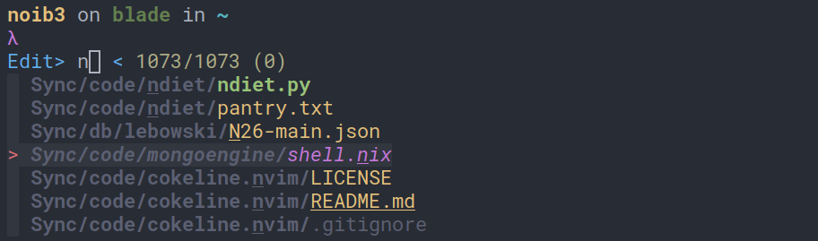

<h1 align="center">&#x1F3E1 dotfil3s</h1>

<div align="center">
  <a href=https://nixos.org/> </a>
  <a href=https://github.com/nix-community/home-manager> </a>
</div>

Hi, these are my dotfiles. Before talking about how the repository is
structured, here's a quick showdown of the various programs I use on a
day-to-day basis:

WIP

## Motivation

WIP

## Why NixOS and home-manager?

WIP

## File structure

```
.
├── colorschemes
│   ├── afterglow
│   ├── gruvbox
│   └── onedark
├── defaults
│   ├── alacritty
│   ├── ...
│   └── zathura
├── machines
│   ├── blade
│   ├── mbair
│   └── sync
└── modules
    └── programs
        └── ...
```

* `/colorschemes`: it contains color specifications for various programs
  divided into color schemes. For example:
  ```nix
  # /colorschemes/afterglow/bspwm.nix
  {
    normal_border = "#393939";
    active_border = "#393939";
    focused_border = "#797979";
  }
  ```
  ```nix
  # /colorschemes/gruvbox/bspwm.nix
  {
    normal_border = "#3c3836";
    active_border = "#3c3836";
    focused_border = "#a89984";
  }
  ```

* `/defaults`: this is where the base configurations for all the programs
  live: the default firefox config is in `/defaults/firefox`, the default
  neovim config is in `/defaults/neovim`, and so on;

* `/machines`: this is where machine-specific configurations live. I'm
  currently managing three machines: a 2021 15" Razer Blade running NixOS, a
  2012 13" MacBook Air running macOS and a DigitalOcean droplet running NixOS.
  Each `/machines/<machine>` folder usually contains:

  * the machine's `home.nix` file (as well as a `configuration.nix` file if it
    runs NixOS);
  * a `fonts` directory containing font-specific program configurations;
  * an `overrides` directory to extend program configurations beyond the base
    configs located inside the `/defaults` folder;
  * a `scripts` directory containing various shell scripts;

* `/modules`: it contains additional configuration modules for programs not yet
  present in home-manager.

## How it all fits together

WIP

## Some `/defaults` you might like

| ***My qutebrowser-inspired [firefox config](https://github.com/noib3/dotfil3s/blob/master/defaults/firefox)*** |
|:--:|
|  |
|  |
| ***My [fzf config](https://github.com/noib3/dotfil3s/blob/master/defaults/fzf)*** |
|  |
|  |
| ***My [neovim config](https://github.com/noib3/dotfil3s/blob/master/defaults/neovim)*** |
|  |
|  |
| ***My [qutebrowser config](https://github.com/noib3/dotfil3s/blob/master/defaults/qutebrowser)*** |
