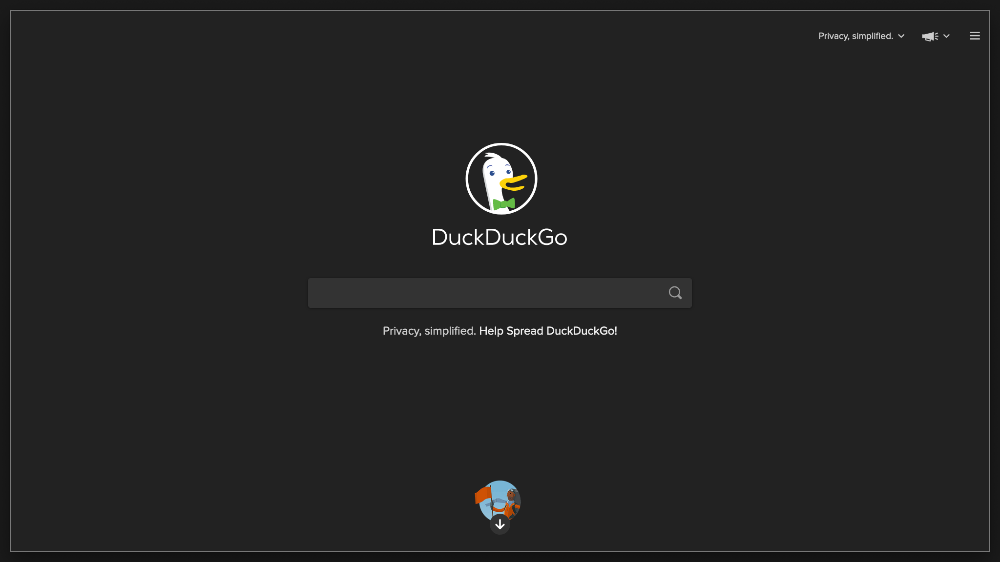
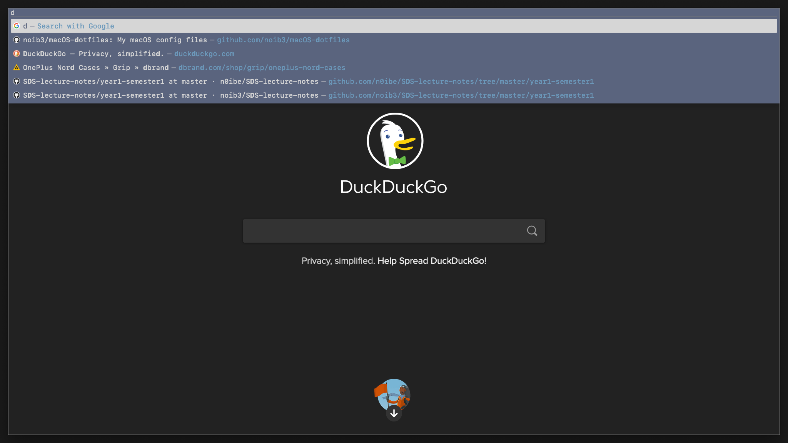
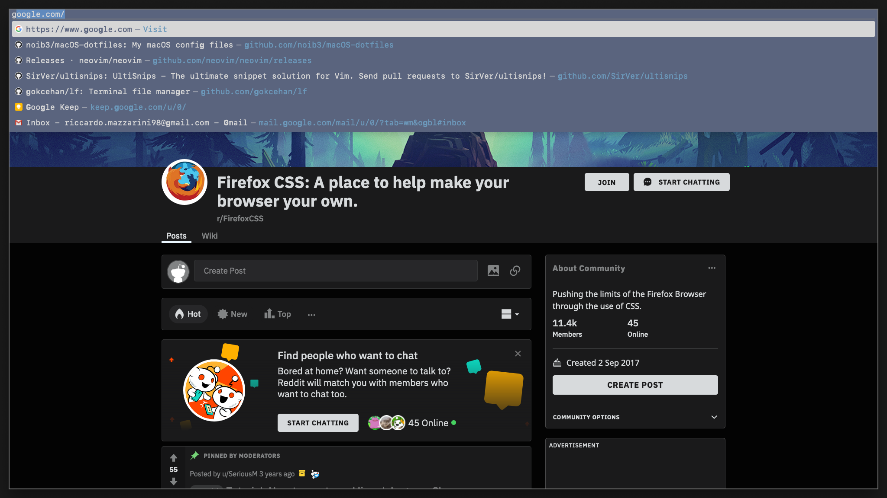

# `/defaults/firefox`

Hi, this is my qutebrowser-inspired firefox setup. Here's a quick showdown of
its features:

|  |
|:--:|
| *DuckDuckGo homepage. The tab bar is hidden when only one tab is present* |
|  |
| *Navbar with custom theme* |
|  |
| *When multiple tabs are present they all take up the same amount of space and each of them is numbered* |
|  |
| *The tab bar is hidden when the navbar is focused* |
|  |
|  |
| *Bookmarks are kept in the sidebar...* |
|  |
| *...and so is Bitwarden, my password manager* |

# Additional settings

Most settings are set by the
[`profiles.home.settings`](https://github.com/noib3/dotfil3s/blob/master/defaults/firefox/default.nix#L69-L91)
attribute inside the
[`default.nix`](https://github.com/noib3/dotfil3s/blob/master/defaults/firefox/default.nix)
file, but a few others have to be set manually. In `about:preferences`:

1. General -> Default zoom -> 133%;
2. Privacy & Security -> Enhanced Tracking Protection -> Send websites a "Do
   Not Track" signal that you don’t want to be tracked -> check `Always`;
3. Privacy & Security -> Logins and Passwords -> uncheck `Ask to save logins
   and passwords for websites`;
4. Privacy & Security -> Firefox Data Collection and Use -> uncheck everything;
5. Privacy & Security -> HTTPS-Only Mode -> check `Enable HTTPS-Only Mode in
   all windows`.

Also, enable all the installed extensions in `about:addons`.
