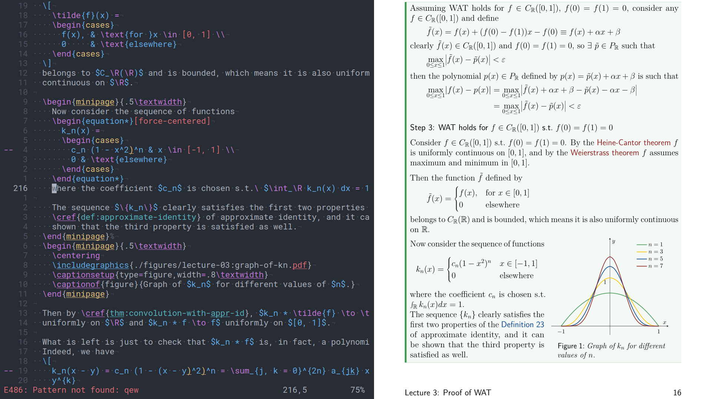
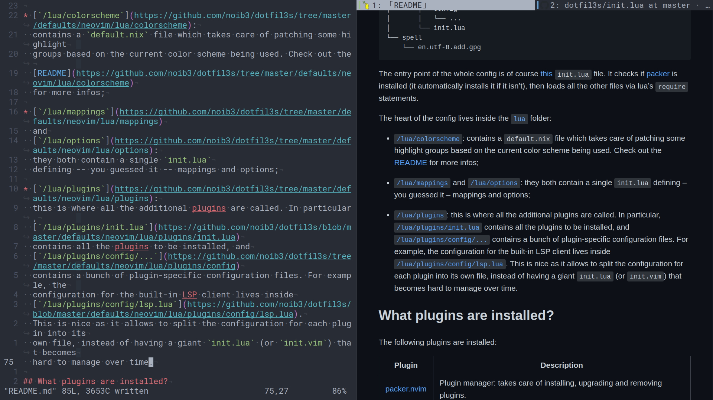

# `/defaults/neovim`

Hi, this is my neovim setup. Here's a quick showdown of what it can do:

|  |
|:--:|
| *Built-in LSP and treesitter support* |
|  |
| *Use [lf](https://github.com/gokcehan/lf) inside a floating terminal to quickly switch between files* |
|  |
| *Use [fzf](https://github.com/junegunn/fzf/blob/master/README-VIM.md) to fuzzy search any file in ~ (check [this](https://github.com/noib3/dotfil3s/tree/master/defaults/neovim/lua/plugins/config/fzf) for my fzf setup inside neovim).* |
|  |
| *Editing LaTeX code on the left and Zathura on the right (as a [wise man](https://www.youtube.com/watch?v=Mphdtdv2_xs) once said, wordcucks BTFO.)* |
|  |
| *Real-time markdown previews in your browser* |

## File structure

```
.
├── after
│   ├── compiler
│   ├── ftplugin
│   └── syntax
│  
├── autoload
│   └── folds.vim
│  
├── init.lua
│  
├── lua
│   ├── colorscheme
│   │   └── default.nix
│   ├── mappings
│   │   └── init.lua
│   ├── options
│   │   └── init.lua
│   └── plugins
│       ├── config
│       │   └── ...
│       └── init.lua
└── spell
    └── en.utf-8.add.gpg
```

The entry point of the whole config is of course
[this](https://github.com/noib3/dotfil3s/blob/master/defaults/neovim/init.lua)
`init.lua` file. It checks if
[packer](https://github.com/wbthomason/packer.nvim) is installed (it
automatically installs it if it isn't), then loads all the other files via
lua's `require` statements.

The heart of the config lives inside the
[`lua`](https://github.com/noib3/dotfil3s/tree/master/defaults/neovim/lua)
folder:

* [`/lua/colorscheme`](https://github.com/noib3/dotfil3s/tree/master/defaults/neovim/lua/colorscheme):
  contains a `default.nix` file which takes care of patching some highlight
  groups based on the current color scheme being used. Check out the
  [README](https://github.com/noib3/dotfil3s/tree/master/defaults/neovim/lua/colorscheme)
  for more infos;

* [`/lua/mappings`](https://github.com/noib3/dotfil3s/tree/master/defaults/neovim/lua/mappings)
  and
  [`/lua/options`](https://github.com/noib3/dotfil3s/tree/master/defaults/neovim/lua/options):
  they both contain a single `init.lua`
  defining -- you guessed it -- mappings and options;

* [`/lua/plugins`](https://github.com/noib3/dotfil3s/tree/master/defaults/neovim/lua/plugins):
  this is where all the additional plugins are called. In particular,
  [`/lua/plugins/init.lua`](https://github.com/noib3/dotfil3s/blob/master/defaults/neovim/lua/plugins/init.lua)
  contains all the plugins to be installed, and
  [`/lua/plugins/config/...`](https://github.com/noib3/dotfil3s/tree/master/defaults/neovim/lua/plugins/config)
  contains a bunch of plugin-specific configuration files. For example, the
  configuration for the built-in LSP client lives inside
  [`/lua/plugins/config/lsp.lua`](https://github.com/noib3/dotfil3s/blob/master/defaults/neovim/lua/plugins/config/lsp.lua).
  This is nice as it allows to split the configuration for each plugin into its
  own file, instead of having a giant `init.lua` (or `init.vim`) that becomes
  hard to manage over time.

## Other things you might like

* My
  [LaTeXFolds](https://github.com/noib3/dotfil3s/tree/master/defaults/neovim/after/ftplugin/tex)
  setup to automatically fold LaTeX documents based on their sectioning
  structure. It can even show section numbers right in the fold titles!

  

* My [formatting
  function](https://github.com/noib3/dotfil3s/tree/master/defaults/neovim/autoload/)
  for fold titles:

  |  |
  |:--:|
  | *All folds closed* |
  |  |
  | *All folds opened* |

* My
  [fzf](https://github.com/noib3/dotfil3s/tree/master/defaults/neovim/lua/plugins/config/fzf)
  setup for neovim;

* My
  [UltiSnips](https://github.com/noib3/dotfil3s/blob/master/defaults/neovim/lua/plugins/config/snippets/sources/tex.snippets)
  snippets that allow me to be fast enough to take LaTeX notes in real time as
  the lecturer speaks (definitely check out [Gilles Castel's
  blog](https://castel.dev/) if you're interested in this sort of stuff).
