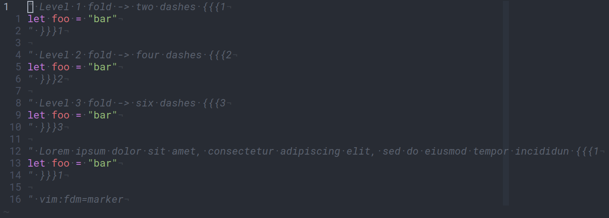

The `folds.vim` file contains two functions:

* `folds#marker_folds_extract_title`: to be used as the value of the
  `foldtext` option (`:h foldtext`) when using marker folds. It strips a raw
  line of all the comment characters and markers (`# foo {{{1` -> `foo`) before
  feeding the result to `folds#format_fold_title`;

* `folds#format_fold_title`: takes in a fold title and formats it into the
  complete fold line. It adds some number of leading dashes depending on the
  fold's level, some number of filler characters after the fold's title and
  it shows how many lines the fold contains. If the fold title is too long it
  will be cut off so that the end of the fold line is always on column 78.

  The end result looks something like this:

  |  |
  |:--:|
  | *All folds closed* |
  |  |
  | *All folds opened* |
